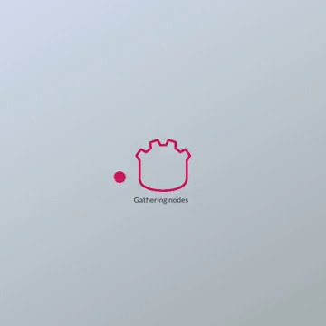
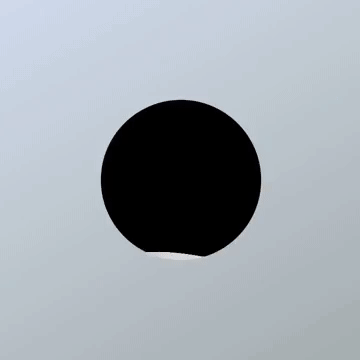
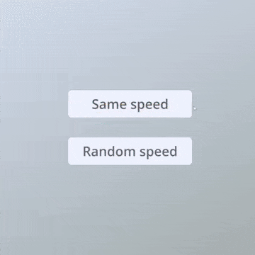

A collection of UI deisgns implemented in Godot 4 ✨

> code from: <a href="https://github.com/MrEliptik/godot_ui_components" target="_blank">MrEliptik</a>

## 🎨 Components

    
    
    
    
    
    
    

## 提交规范

- `feat` 增加新功能
- `fix` 修复问题/BUG
- `style` 代码风格相关无影响运行结果的
- `perf` 优化/性能提升
- `refactor` 重构
- `revert` 撤销修改
- `test` 测试相关
- `docs` 文档/注释
- `build` 对构建系统或者外部依赖项进行了修改
- `chore` 依赖更新/脚手架配置修改等
- `workflow` 工作流改进
- `ci` 持续集成
- `types` 类型定义文件更改
- `wip` 开发中